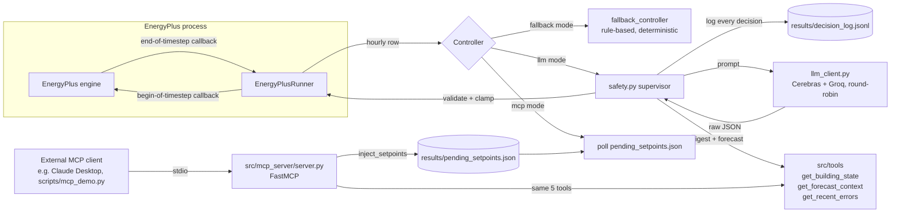

# ARCHITECTURE.md: Eco-Loop Building Agents

## System overview

Everything runs in **one EnergyPlus process** driven through the bundled
`pyenergyplus` runtime API. No file rewrite-and-rerun, no FMU or BCVTB bridge,
no inter-process hop on the control path. The agent reads and writes the same
in-memory simulation state the engine is stepping, which is what makes an
hourly closed loop possible at all: a rewrite-and-rerun design cannot inject a
setpoint into a run that is already in progress.

**The controller contract.** A `Controller` is any callable of the shape
`(row, day_of_year, hour, day_of_week) -> (heating_c, cooling_c,
fan_available)`. `scripts/run_agent.py --controller {fallback,llm,mcp}` selects
which implementation is wired in; nothing else in the runner changes. The
rule-based controller, the LLM supervisor, and the MCP poller are therefore
interchangeable behind one signature, and the runner has exactly one actuation
path to get right. Three actuators ride that one signature, including the AHU
fan availability schedule, rather than each control surface growing its own
hook.

## Simulation loop and metering

**Two callbacks, split by direction.** The loop reads at
`callback_end_zone_timestep_after_zone_reporting` and writes at
`callback_begin_system_timestep_before_predictor`. The split matters because
the agent must decide for hour H using hour H-1's completed data, then have
those setpoints in place before the engine's predictor runs for hour H. Reading
and writing in one callback would either act on half-finished data or apply
setpoints a timestep late.

**Energy is read once per zone timestep, not per system timestep.** The HVAC
manager subdivides a zone timestep into extra system sub-timesteps during load
ramps to converge, and each sub-timestep's meter value already reflects
everything accumulated since the last zone-timestep reset. Summing per system
timestep therefore multiplies energy exactly on ramp hours, which are the hours
where all the interesting control action happens. The zone-timestep callback is
crossed exactly once per zone timestep regardless of internal subdivision, so
it is the correct accumulation point.

**Hour boundaries are detected by `hour()` changing, not by clock arithmetic.**
EnergyPlus can shorten zone timesteps below the nominal 15 minutes for
convergence, so a test like `minutes(state) % 60 == 0` silently misses hours,
folding their energy into whichever later hour does land on the boundary.
Watching for the `hour()` value to change between calls is robust to arbitrary
sub-hour subdivision.

**Both callbacks share one hour-transition detector** (`_maybe_flush_hour` in
`src/simulation/runner.py`). Both observe the same rollover, but
begin-timestep fires first within a system timestep. Without shared detection,
the controller reads `self.rows[-1]` before the previous hour has been
flushed and so decides on data one hour staler than intended. Whichever
callback fires first performs the flush, so anything reading `self.rows[-1]`
sees the intended hour.

**EnergyPlus's own meter file is the authority for every headline number.**
`src/analysis/metrics.py` reads `eplusmtr.csv` directly rather than the
runner's Python-side accumulation, so no reported saving depends on the loop's
own bookkeeping being right. `scripts/smoke_test.py` asserts the two agree
within 0.5% (0.00% in practice) as a permanent regression guard.

## Tool-calling architecture

Five plain Python functions in `src/tools/building_tools.py` are the single
source of truth ("built once, exposed twice"):

| Tool | Purpose |
|---|---|
| `get_building_state` | Compact digest of the last completed hourly reading |
| `get_forecast_context` | Next N hours of occupancy + grid carbon/tariff |
| `propose_setpoints` | Builds the prompt, calls the LLM, returns raw text |
| `inject_setpoints` | Clamps to the hard safety range, optionally writes the MCP pending-setpoints file |
| `get_recent_errors` | Tails the E+ `.err` file + failed decisions from the log |

They're consumed two ways:
1. **Directly**, by `src/agent/safety.py`'s supervisor inside the hot control
   loop - no IPC, no serialization overhead, this is the reliability path.
2. **Over MCP**, by `src/mcp_server/server.py` (FastMCP, stdio transport) - for
   spec compliance and so an external MCP client (Claude Desktop,
   `scripts/mcp_demo.py`) can inspect state and drive setpoints without touching
   the Python loop's source.

Because both paths call the same functions, there is exactly one place that
knows how to read a digest or clamp a setpoint - the MCP server cannot drift out
of sync with the in-process loop's behavior.

### MCP transport: file-based, upgradeable

`inject_setpoints` writes `results/pending_setpoints.json`. When
`scripts/run_agent.py` is run with `--controller mcp`, the runner polls that
file's mtime once per simulated hour and actuates whatever's there, falling
back to the deterministic rule-based controller if nothing new has been
written since the last poll (an MCP client that misses an hour must never
stall the simulation). Verified end-to-end: a setpoint written via the
`inject_setpoints` MCP tool call was read back by the very next simulated hour
of a live run (`results/raw/agent_mcp/state.csv`, hour 0: 21.0/24.5 °C, matching
the injected pair exactly).

This is a deliberate simplification, not a limitation of the tool interface -
the five tool signatures don't change if the transport is upgraded later to a
socket/queue for true synchronous IPC with a running instance. That upgrade is
explicitly deferred past the submission deadline: it is the one architectural
change that could hang a live demo run, which directly conflicts with the 30%
System Integration weight ("closed loop runs an extended horizon without
crashing"). A polled file is boring and cannot hang the simulation.

## Safety supervisor (the reliability path)

`src/agent/safety.py` wraps every LLM call. The design principle is that the
LLM is an *advisor* whose output is never trusted directly: every value it
produces passes through deterministic validation the model cannot influence,
and any failure at any stage resolves to a known-good deterministic answer
rather than to an error.

1. Build the prompt from `get_building_state` + `get_forecast_context` +
   `get_recent_errors`.
2. Call the LLM with `response_format={"type": "json_object"}` and a hard
   timeout (the OpenAI client's own `timeout=`, no custom watchdog thread
   needed - connect/read/write/pool are all covered).
3. `json.loads` + Pydantic schema validation (`SetpointDecision`). On failure,
   **one retry** with the validation error fed back to the model.
4. Clamp the validated pair through `src/agent/fallback.py`'s
   `clamp_setpoints` - the same range logic the rule-based controller uses, not
   reimplemented.
5. **Any** failure along this path (timeout, network error, invalid JSON after
   retry, provider outage) falls through to `fallback_controller` with
   `fallback_used=True` logged. The simulation is never blocked on the LLM.
6. Every decision - prompt inputs, raw reply, provider, latency, retry flag,
   clamped result, fallback flag, error - is appended as one line to
   `results/decision_log.jsonl`.

**Anti-thrash rate limit.** The supervisor caps hour-to-hour setpoint movement
at ±1.5 °C, exempted across an occupied/unoccupied transition where a real step
is the point. This bounds two distinct failure modes with one rule: an LLM
oscillating hour to hour, and the discontinuity when a failed LLM hour hands
over to a very different fallback value mid-run.

**Comfort ceiling on occupied cooling.** `COMFORT_MAX_COOLING_C = 25.5` caps
occupied cooling setpoints, re-clamping to preserve the minimum deadband. The
bound is measured rather than chosen: across occupied zone-hours, hot-side PMV
breaches concentrate above 25.5 °C (7 of 40 zone-hours spent above it breached,
versus 1 of 205 at or below). It runs as the **last** stage of the chain, after
the clamp and the anti-thrash limiter, so that a setpoint legitimately coming
down from a high prior value cannot be dragged back out of band by the rate
limiter. It is logged under its own `was_comfort_capped` flag rather than
folded into `was_clamped`, because a value the clamp passed through untouched
can still be moved at this stage, and reporting that as `was_clamped=False`
would hide it.

Note that the clamp ranges are occupancy-aware: the wide unoccupied setback
(heating down to 15 °C, cooling up to 30 °C) is legal and intended, while
occupied hours are held to the narrow comfort-safe band. A setback value that
looks extreme in the log is the design working, not a clamp escape.

**Verified crash-proof with the LLM totally unreachable**: a full 7-simulated-day
run with `GROQ_API_KEY=` and `FALLBACK_API_KEY=` both blank completed with exit
code 0, 168/168 hourly rows, 168/168 setpoint injections, 0 controller errors,
and all 168 decision-log entries marked `fallback_used: true` - numerically
identical output to a pure rule-based run (1018.3 kWh, 92.0% comfort in-band),
confirming the fallback path is exactly the deterministic controller, not an
approximation of it. The log is shipped as `results/decision_log_llm_unreachable.jsonl`.

## Prompt strategy

`src/agent/prompts.py`'s system prompt states the priority order explicitly
(comfort floor is hard and non-negotiable, then energy, then carbon/cost) and
repeats the hard clamp ranges so the model has every incentive to stay inside
them even though a supervisor enforces it regardless. The user prompt is the
JSON-encoded digest + forecast - never raw simulation output.

**Named comfort-safe band.** The prompt names **24.5-25.5 °C as the
comfort-safe occupied cooling band** and points the model at `worst_pmv`
(already in the state digest) as a cool-back-down signal. Guidance that only
says "warmer saves energy" without naming an upper bound lets the model drift
toward whatever the clamp permits, so the advisory band and the enforced
ceiling are stated as the same number from both directions: the prompt asks,
the supervisor guarantees.

**The decided hour is named explicitly.** `current_state` always describes the
last *completed* hour, while the decision applies to the *next* one. Those two
differ precisely at occupancy transitions, which are the highest-leverage hours
in the whole run. `get_forecast_context` therefore returns
`decision_hour_occupied` (the occupancy of the hour actually being set,
computed the same predictive way `safety.py` and `fallback.py` already do it),
and the system prompt states that `current_state` describes the previous hour
while this flag describes the one being decided. Without it the model has no
way to know the building empties at the end of the hour it is setting, and will
correctly-but-uselessly reason to hold comfort for occupants who are leaving.

**Bounded error feedback.** `get_recent_errors` feeds recent failures back into
the prompt (the spec's "extract runtime errors" requirement, and the
self-correction input), clipped to `MAX_ERROR_CHARS = 160` per entry. The bound
is load-bearing, not cosmetic: raw provider error bodies run ~250 chars each,
and five of them add roughly 620 tokens per call, a 31% prompt inflation that
engages *only once failures start*, which is exactly when a token budget is
already the thing failing. Unbounded error echo amplifies the failure it
describes. The same constant is applied where `safety.py` logs exceptions, so
provider error text cannot reach the decision log unclipped either.

**Provider quirk.** Groq requires the literal word "json" (lowercase) somewhere
in the message content when `response_format={"type": "json_object"}` is set,
or it 400s. The system prompt satisfies this by construction.

## Long-log / high-volume-data handling

The LLM never sees EnergyPlus's raw output (`.eso`, `.err`, or the runner's
5-zones × N-hours CSV). `get_building_state` reduces one hourly reading to ~12
scalar fields (mean/min/max zone temp, the single worst-|PMV| zone, current
setpoints, outdoor temp, energy this hour) regardless of how many zones exist.
`get_forecast_context` caps the lookahead window at a fixed horizon (default 6
hours) rather than exposing the full 24 h carbon/tariff table. `get_recent_errors`
tails only the last N severity lines from `.err` plus the last N failed
decisions - never the full log. **Net effect: prompt size is constant regardless
of simulation horizon** - a 7-day run and a 30-day run send the same-sized
prompt every hour.

## Latency measurement & management

Measured against Groq `openai/gpt-oss-120b` and Cerebras `gpt-oss-120b` (both
served through the identical OpenAI-compatible chat-completions shape, so only
`base_url`/`api_key`/`model` differ between the two):

| Scenario | Result |
|---|---|
| Trivial prompt (`"Reply with exactly one word"`) | Groq 996 ms, Cerebras 405 ms |
| Real prompt, 2-sim-day run, 48 decisions | p50 1.0-1.5 s, p95 ~2.2-2.5 s |
| Full 7-sim-day live run, 168 decisions | wall clock ≈ 7 min total (incl. E+ compute) |
| Full 14-sim-day soak, 336 decisions | p50 693 ms, p95 1641 ms |

p95 sits roughly 7x inside the watchdog timeout, which is the headroom that
makes the hourly cadence safe rather than merely observed-to-work.

**Reasoning-model token floor.** `gpt-oss-120b` spends completion tokens on a
hidden `reasoning` field before emitting `content`. A `max_tokens` ceiling
that is too tight truncates mid-reasoning and returns `content=None` rather
than a short answer, which reads as an invalid response instead of a truncated
one. `MAX_TOKENS = 1000` in `llm_client.py` is set above that floor
deliberately.

### Rate limiting

EnergyPlus steps through simulated hours far faster than real time, so a run's
24-336 hourly decisions can fire within seconds of each other in wall-clock
time, straight into free-tier caps. `llm_client.py` enforces a minimum
real-time interval between calls to the *same* provider
(`LLM_MIN_CALL_INTERVAL_SECONDS`). This is a floor on wall-clock spacing only;
the *simulated* hourly decision cadence is unchanged. When a provider is still
throttled despite the floor, the supervisor's fallback absorbs it exactly like
any other LLM failure: zero controller errors, zero crashes.

**The interval is sized against a token budget, not a request count.** These
providers' binding constraint at this project's ~2.2K tokens per call is
tokens-per-minute, not requests-per-minute, and the two imply very different
spacings. Groq's own 429 body is explicit about which one bound: `"Rate limit
reached ... on tokens per minute (TPM): Limit 8000, Used 6542, Requested
2222"`. At ~2200-2700 tokens per call, an 8000 TPM cap sustains ~3.2
calls/minute (~19 s apart), not the ~24 calls/minute a request-count
assumption implies - an 8x error in exactly this shape. The general rule the
code follows: a 429's *body*, not just its status code, is the specification
for how to back off.

### Provider selection and throttling

Published free-tier `gpt-oss-120b` limits, measured against this project's
~2.2K tokens/call. The two providers are bound by *opposite* limits:

| Provider | RPM | RPD | TPM | TPD | Binds on | Full 7-day runs/day |
|---|---|---|---|---|---|---|
| Groq | 30 | 1K | 8K | 200K | **TPM** → ~17s spacing | ~0.5 |
| Cerebras | 5 | 2.4K | 30K | 1M | **RPM** → ~12s spacing | **~2.7** |

Groq has 6x the request headroom but a quarter of the token headroom, and
cannot complete even one full 7-day run per day on tokens alone. Two design
consequences:

1. **Cerebras is the preferred provider**, with per-call round-robin across
   both and within-call failover to the other. Round-robin spreads load across
   two independent budgets instead of exhausting one; failover means a single
   provider outage costs a retry, not a fallback.
2. **Throttle intervals are per-provider**, not global. A single global
   interval necessarily over-throttles whichever provider is less constrained:
   a uniform 19 s left Cerebras idle 7 s longer than its own limit required on
   every call.

Because the identical model is served by both hosts, prompts and output format
never change between providers. Only the backend does.

Combined budget is ~3.2 full 7-day runs/day (~23 one-day runs), which is why
the project needs no additional accounts to iterate. The corresponding
practice: **don't spend LLM calls on config testing** - non-LLM changes
(metering, actuators, comfort, energy) run under `--controller fallback` at
zero token cost in ~40s, prompt work uses `--days 1`, and full 7-day LLM runs
are reserved for final headline numbers.

## Sensed inputs beyond temperature

The spec names indoor air quality and peak-demand thresholds as reasoning
inputs, so both are streamed into the state digest alongside temperature and
PMV.

**CO2 / IAQ.** `ZoneAirContaminantBalance` (CO2 = Yes) plus an outdoor-CO2
schedule (~400 ppm) and `Output:Variable,*,Zone Air CO2 Concentration,Hourly`
in `idf_prep.py`, a resolved handle per zone in `runner.py`, and
`max_zone_co2_ppm` surfaced in `get_building_state`. The 5 People objects
leave `Carbon Dioxide Generation Rate` blank, which EnergyPlus auto-defaults to
the ASHRAE Std 62.1 value (3.82E-8 m3/s-W), the same default EnergyPlus's own
CO2-enabled example files rely on, so enabling CO2 required no People-object
edit. CO2 is a passive tracer here and must not move energy: the baseline was
re-run after the IDF change and total kWh held at 1100.1 (was 1100.0).

**Peak demand.** A running `peak_kw_so_far` tracker lives in `safety.py`'s
controller closure, the only place with run history across hours, and a
measured `PEAK_DEMAND_THRESHOLD_KW = 19.0` (baseline's own measured 7-day peak
is 19.9 kW) is threaded through `get_building_state`. The prompt asks the model
to spread a large pre-conditioning move over more hours rather than spike
toward the threshold in one, which is the lever a supervisory controller
actually has over demand charges.

**Humidity.** `mean_zone_rh_pct` is surfaced to the model from data the runner
already streamed into every row.

## Offline / compliance note

`GROQ_API_KEY`/`FALLBACK_API_KEY` point at hosted OpenAI-compatible endpoints
running an open-weight model (`gpt-oss-120b`), satisfying the spec's "self-hosted
API" language. For a fully offline setup, point `GROQ_MODEL`/`GROQ_API_KEY`'s
`base_url` at a local Ollama instance (`http://localhost:11434/v1`) serving the
same or an equivalent open model - the client code is unchanged since Ollama
speaks the same OpenAI-compatible chat-completions shape.

## Reliability soak

The 30% System Integration criterion asks for an extended horizon without
crashing, so the loop is exercised at 2x the standard 7-day horizon: 14
simulated days, 336 hourly decisions. (14 days is still within `idf_prep.py`'s
17-day cap, since the run period starts fixed at Jul 15.)

Two soaks, covering different failure surfaces:

| Soak | Controller | Result |
|---|---|---|
| `results/raw/soak/` | fallback | exit 0, 336/336 rows, 336/336 injections, 0 controller errors |
| `results/raw/soak_llm/` | llm | exit 0, 336/336 rows and injections, 0 controller errors, **0/336 fallbacks**, p50 693 ms / p95 1641 ms, 92.9% occupied comfort |

The first isolates the EnergyPlus/Python loop with zero LLM calls in play. The
second proves the same horizon with the LLM live the entire time and every
decision genuine, round-robined across both providers - a stronger
participation rate than any 7-day run, because the longer horizon spaces calls
further apart in wall-clock time relative to the throttle floor.

`models/baseline.idf` is confirmed byte-identical after a soak: the run's IDF
copy goes to a scratch path, per the `--days != 7` guard in
`scripts/run_agent.py`, so the deliverable IDF is never modified by an
off-horizon run.

The full decision log is tracked at `results/decision_log_soak14.jsonl` (336
entries, same evidence-package treatment as
`results/decision_log_llm_unreachable.jsonl`) and surfaced on
`results/dashboard.html` as its own strip below the savings charts
(`_reliability_strip_html` in `src/analysis/dashboard.py`), since it has no
matching-horizon baseline to compare against and so cannot be more savings
cards.

## Headline results (baseline vs agent, 7 simulated days, Jul 15-21 Chicago)

All energy from `eplusmtr.csv` via `src/analysis/metrics.py`, not the
runner's own accumulation.

| Run | Total elec. kWh | HVAC kWh | Comfort in-band | Gas kWh | Peak kW | kg CO2 |
|---|---|---|---|---|---|---|
| Baseline (fixed schedule) | 1100.1 | 413.7 | 80.7% | 32.9 | 19.9 | 663.8 |
| Agent, rule-based floor (no LLM) | 1018.4 | 332.0 | 92.0% | 0.0 | N/A | 610.4 |
| Agent, LLM + supervisor | **1003.6** | **317.3** | **93.1%** | 3.6 | **19.0** | **602.2** |

- **Rule-based floor:** +7.4% total / +19.7% HVAC, comfort **up 11.3 points**,
  reheat gas eliminated entirely.
- **LLM + supervisor:** +8.8% total / +23.3% HVAC, comfort **up 12.4 points**,
  peak demand held right at the measured `PEAK_DEMAND_THRESHOLD_KW` target
  (19.0 kW, vs baseline's 19.9) - beats the floor on every axis simultaneously.
  168/168 injections, 0 controller errors, 3 fallback (3/168, a provider
  hiccup not a model failure), 0 retried, latency p50 816 ms / p95 2120 ms,
  comfort guard never triggered (0/168 `was_comfort_capped`), 165/168 genuine
  LLM decisions split 85 Cerebras / 80 Groq.

Both beat baseline on energy *and* comfort simultaneously: savings are not
bought at occupants' expense, and the LLM beats its own deterministic fallback
on energy, HVAC energy, and comfort at once, so the intelligence is doing
measurable work rather than only adding risk.

**What drives the rule-based floor's numbers**, in order of impact: (1) the AHU
fan actuator no longer conditions the building 2 extra hours/day outside
occupancy, (2) predictive rather than reactive occupancy gives the first
occupied hour the right clamp range instead of the previous hour's, and (3)
deterministic setpoint targets sit in the middle of the locked 24-28 °C
occupied range rather than at the baseline's over-cooled 23.9 °C.

**What the LLM adds on top of that floor** is concentrated in the hours the
fixed rule cannot reason about: it shifts pre-conditioning into low-carbon,
low-tariff windows using the 24 h grid forecast, eases into occupancy in
stages instead of stepping, and sets back at the exact transition hour rather
than on a fixed clock.

62% of total facility electricity is lighting/plug load that neither setpoints
nor fan control can touch, which is why the total-kWh percentage is
structurally capped and why **HVAC-only % is the honest measure** of what
supervisory control actually moves. Both figures are reported rather than only
the flattering one.

## Rejected alternatives (measured, not shipped)

Two plausible optimizations were built and measured, and the data did not
support shipping either. Both are recorded here because the reasoning is part
of the design rationale: the current behavior is a choice, not an oversight.

### CO2-gated fan-off

The obvious next step after adding CO2 sensing is to require
`max_zone_co2_ppm` below a threshold before `clamp_fan_available` honors a
fan-off request, treating IAQ as a hard constraint the way temperature already
is. Measured, it backfires. This building's `DesignSpecification:OutdoorAir`
is per-person, so outdoor-air intake (and therefore CO2 removal) drops to ~0
once occupancy hits 0: max zone CO2 sat flat around 1060 ppm for 6+ straight
unoccupied hours with the fan already ON the whole time, never dropping under
a 1000 ppm threshold. The gate is unreachable for most of the night, which
silently disables fan-off entirely (0/113 unoccupied hours, versus routinely
>0 before) for zero safety benefit: the guard's own both-hours-unoccupied
check already forces the fan back on at least an hour before occupants arrive
regardless of CO2, so nobody is ever present under a fan-off decision. CO2
therefore stays a first-class *sensed* value in the state digest and prompt,
without gating a working actuator on a safety property that is already
structurally guaranteed elsewhere.

### Optimal-start pre-heat

12 of 275 occupied zone-hours show cold-side PMV violation at hour 8,
identically across baseline, the rule-based floor, and the LLM, which looks
like night setback outrunning zone recovery. The obvious fix is to raise the
heating setpoint before occupancy rather than at it. Measured with a free
`--controller fallback` run before spending any LLM budget:

| Attempt | Hour-8 cold violations (of 25 zone-hours) | HVAC savings vs baseline | Gas |
|---|---|---|---|
| No pre-heat (current) | 12 | 19.7% | 0.0 kWh |
| 1h lead, heating→21C | 12 (unchanged) | 11.1% | 4.5 kWh |
| 2h lead, heating→21C | 12 (unchanged) | 11.1% | 7.4 kWh |
| 2h lead, heating→23C (range ceiling) | 11 (−1) | 10.5% | 51.2 kWh |

Even at the most aggressive setting legally available under the locked clamp
range, the violation count barely moves while HVAC savings give back 9+ points
and reheat gas spikes 0→51 kWh. This is structural rather than a lead-time
problem, confirmed independently: **the baseline schedule already runs its AHU
fan 06:00-20:00**, a built-in 2-hour lead over the 08:00-19:00 occupancy
window, and has the identical 12-zone-hour violation anyway. This building's
zone thermal recovery from night setback is capacity-limited, not
schedule-limited. No setpoint-only lever fixes it without a cost that
outweighs the benefit.

## What's deliberately deferred

- **Full live IPC for MCP** (socket/queue instead of a polled file) - it is the
  one change that could hang a live demo run, which conflicts directly with the
  System Integration criterion. The MCP `inject_setpoints` tool also doesn't
  expose fan control (the third actuator is core-loop-only), so the mcp
  controller mode always leaves the fan on; widening that tool's signature is
  the upgrade path if the MCP demo needs it.
- **Hour-8 morning cold-side violations** - investigated and reverted, not
  skipped; see "Optimal-start pre-heat" above for the measured data. A real fix
  needs increased heating capacity or a shallower night setback depth (trading
  overnight savings for the morning transition), out of scope for a
  locked-range, minimal-IDF-change pass.
