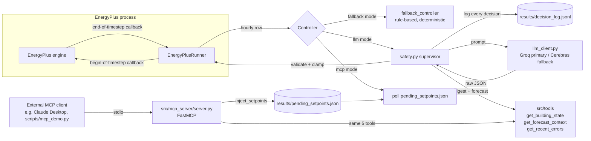

# ARCHITECTURE.md — Eco-Loop Building Agents

## System overview

One EnergyPlus process, two callbacks (per CLAUDE.md's "read at end-of-timestep,
write at begin-of-timestep" split — see `src/simulation/runner.py`'s docstring for
why). A `Controller` is any `(row, day_of_year, hour, day_of_week) -> (heating_c,
cooling_c)` callable; `scripts/run_agent.py --controller {fallback,llm,mcp}`
selects which one is wired into the loop. Swapping controllers changes nothing
else in the runner — this is what let Phase 2's rule-based controller and Phase
3's LLM supervisor share one code path with zero duplication.

## Tool-calling architecture

Five plain Python functions in `src/tools/building_tools.py` are the single
source of truth (CLAUDE.md's "built once, exposed twice"):

| Tool | Purpose |
|---|---|
| `get_building_state` | Compact digest of the last completed hourly reading |
| `get_forecast_context` | Next N hours of occupancy + grid carbon/tariff |
| `propose_setpoints` | Builds the prompt, calls the LLM, returns raw text |
| `inject_setpoints` | Clamps to the hard safety range, optionally writes the MCP pending-setpoints file |
| `get_recent_errors` | Tails the E+ `.err` file + failed decisions from the log |

They're consumed two ways:
1. **Directly**, by `src/agent/safety.py`'s supervisor inside the hot control
   loop — no IPC, no serialization overhead, this is the reliability path.
2. **Over MCP**, by `src/mcp_server/server.py` (FastMCP, stdio transport) — for
   spec compliance and so an external MCP client (Claude Desktop,
   `scripts/mcp_demo.py`) can inspect state and drive setpoints without touching
   the Python loop's source.

Because both paths call the same functions, there is exactly one place that
knows how to read a digest or clamp a setpoint — the MCP server can't drift out
of sync with the in-process loop's behavior.

### MCP transport: file-based, upgradeable

`inject_setpoints` writes `results/pending_setpoints.json`. When
`scripts/run_agent.py` is run with `--controller mcp`, the runner polls that
file's mtime once per simulated hour and actuates whatever's there, falling
back to the deterministic rule-based controller if nothing new has been
written since the last poll (an MCP client that misses an hour must never
stall the simulation). Verified end-to-end: a setpoint written via the
`inject_setpoints` MCP tool call was read back by the very next simulated hour
of a live run (`results/raw/agent_mcp/state.csv`, hour 0: 21.0/24.5 °C, matching
the injected pair exactly).

This is a deliberate simplification, not a limitation of the tool interface —
the five tool signatures don't change if the transport is upgraded later to a
socket/queue for true synchronous IPC with a running instance. That upgrade is
explicitly deferred past the submission deadline: it is the one architectural
change that could hang a live demo run, which directly conflicts with the 30%
System Integration weight ("closed loop runs an extended horizon without
crashing"). A polled file is boring and cannot hang the simulation.

## Safety supervisor (the reliability path)

`src/agent/safety.py` wraps every LLM call:

1. Build the prompt from `get_building_state` + `get_forecast_context` +
   `get_recent_errors`.
2. Call the LLM with `response_format={"type": "json_object"}` and a hard
   timeout (the OpenAI client's own `timeout=`, no custom watchdog thread
   needed — connect/read/write/pool are all covered).
3. `json.loads` + Pydantic schema validation (`SetpointDecision`). On failure,
   **one retry** with the validation error fed back to the model.
4. Clamp the validated pair through `src/agent/fallback.py`'s
   `clamp_setpoints` — the same range logic the rule-based controller uses, not
   reimplemented.
5. **Any** failure along this path (timeout, network error, invalid JSON after
   retry, provider outage) falls through to `fallback_controller` with
   `fallback_used=True` logged. The simulation is never blocked on the LLM.
6. Every decision — prompt inputs, raw reply, provider, latency, retry flag,
   clamped result, fallback flag, error — is appended as one line to
   `results/decision_log.jsonl`.

**Verified crash-proof with the LLM totally unreachable**: a full 7-simulated-day
run with `GROQ_API_KEY=` and `FALLBACK_API_KEY=` both blank completed with exit
code 0, 168/168 hourly rows, 168/168 setpoint injections, 0 controller errors,
and all 168 decision-log entries marked `fallback_used: true` — numerically
identical output to Phase 2's pure rule-based run (1410.5 kWh, 91.6% comfort
in-band), confirming the fallback path is exactly the deterministic controller,
not an approximation of it.

## Prompt strategy

`src/agent/prompts.py`'s system prompt states the priority order explicitly
(comfort floor is hard and non-negotiable, then energy, then carbon/cost) and
repeats the hard clamp ranges so the model has every incentive to stay inside
them even though a supervisor enforces it regardless. The user prompt is the
JSON-encoded digest + forecast — never raw simulation output.

One quirk worth documenting: Groq requires the literal word "json" (lowercase)
somewhere in the message content when `response_format={"type":
"json_object"}` is set, or it 400s with `'messages' must contain the word
'json'...`. The system prompt satisfies this by construction.

## Long-log / high-volume-data handling

The LLM never sees EnergyPlus's raw output (`.eso`, `.err`, or the runner's
5-zones × N-hours CSV). `get_building_state` reduces one hourly reading to ~12
scalar fields (mean/min/max zone temp, the single worst-|PMV| zone, current
setpoints, outdoor temp, energy this hour) regardless of how many zones exist.
`get_forecast_context` caps the lookahead window at a fixed horizon (default 6
hours) rather than exposing the full 24 h carbon/tariff table. `get_recent_errors`
tails only the last N severity lines from `.err` plus the last N failed
decisions — never the full log. **Net effect: prompt size is constant regardless
of simulation horizon** — a 7-day run and a 30-day run send the same-sized
prompt every hour.

## Latency measurement & management

Measured against Groq `openai/gpt-oss-120b` and Cerebras `gpt-oss-120b` (both
served through the identical OpenAI-compatible chat-completions shape, so only
`base_url`/`api_key`/`model` differ between primary and fallback):

| Scenario | Result |
|---|---|
| Phase 0 trivial prompt (`"Reply with exactly one word"`) | Groq 996 ms, Cerebras 405 ms |
| Phase 3 real prompt, 2-sim-day run, 48 decisions | p50 1.0–1.5 s, p95 ~2.2–2.5 s |
| Full 7-sim-day live run, 168 decisions | wall clock ≈ 7 min total (incl. E+ compute) |

`gpt-oss-120b` is a reasoning model: it spends completion tokens on a hidden
`reasoning` field before emitting `content`. A `max_tokens` ceiling that's too
tight truncates mid-reasoning and leaves `content=None` — this cost real
debugging time in Phase 0 (see `scripts/llm_smoke.py`'s comment) and is now a
documented constant (`MAX_TOKENS = 1000` in `llm_client.py`).

**Rate limiting.** EnergyPlus steps through simulated hours far faster than
real time, so a run's ~24–168 hourly decisions can fire within seconds of each
other in wall-clock time — straight into free-tier requests-per-minute caps.
Observed directly during testing: Groq 429 `"Requests per minute limit
exceeded"` mid-run. `llm_client.py` enforces a minimum real-time interval
between calls to the *same* provider (`LLM_MIN_CALL_INTERVAL_SECONDS`, default
2.5 s) — a floor on wall-clock spacing, not a change to the hourly *simulated*
decision cadence, which stays locked per CLAUDE.md. When a provider is still
throttled despite the floor, the safety supervisor's fallback absorbs it
exactly like any other LLM failure: zero controller errors, zero crashes,
proven in every run above.

## Offline / compliance note

`GROQ_API_KEY`/`FALLBACK_API_KEY` point at hosted OpenAI-compatible endpoints
running an open-weight model (`gpt-oss-120b`), satisfying the spec's "self-hosted
API" language. For a fully offline setup, point `GROQ_MODEL`/`GROQ_API_KEY`'s
`base_url` at a local Ollama instance (`http://localhost:11434/v1`) serving the
same or an equivalent open model — the client code is unchanged since Ollama
speaks the same OpenAI-compatible chat-completions shape.

## What's deliberately deferred

- **Full live IPC for MCP** (socket/queue instead of a polled file) — after
  the savings/dashboard work lands, since it's the one change that could hang
  a live demo run.
- **Prompt/policy tuning for the ≥10–15% savings target** — Phase 3's job was
  wiring + crash-proofness; Phase 4 tunes `prompts.py` against the forecast
  levers this phase built. The untuned live run (1813.5 kWh vs 1281.2 kWh
  baseline) is worse than baseline for two combined reasons: an untuned prompt,
  and today's elevated fallback rate from cumulative API-quota exhaustion
  during testing — both addressed in Phase 4, not signs of a broken loop
  (0 controller errors, exit 0 in every run above).
